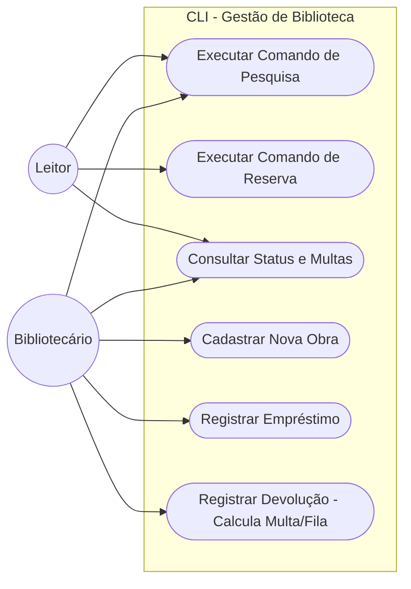
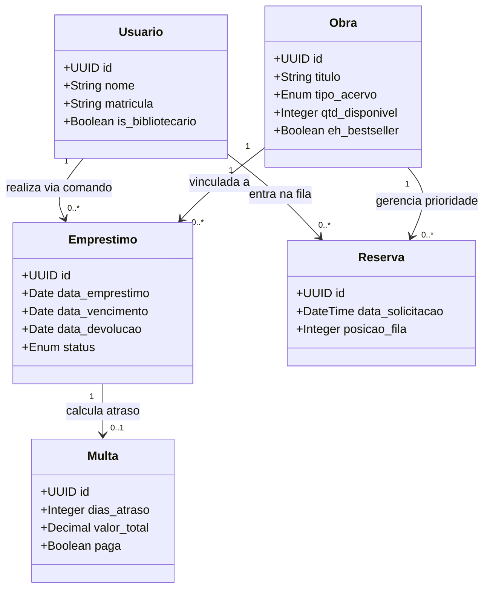

# 📚 Omni Library — Sistema de Gestão de Biblioteca


API REST desenvolvida para modernizar o controle de acervos físicos e digitais de uma biblioteca. O sistema visa resolver problemas clássicos como o sumiço de obras, a falta de rotação adequada de best-sellers e a reeducação do leitor por meio de regras rigorosas de devolução, reservas e controle de multas.

---

## 👥 Informações do Projeto

- **Nome do Projeto:** Omni Library
- **Integrantes:** Angelina Borroni; Maria Fernanda Diniz
- **Solicitante:** Prof. Juan Hassem

---

## 🎯 Visão Geral e Regras de Negócios

O sistema foi arquitetado para atender às seguintes regras de negócio primordiais:

1. **Reserva antecipada e fila de prioridade:** Lógica otimizada para a reserva de exemplares altamente disputados, organizando os usuários em filas prioritárias.
2. **Cálculo automatizado de multas:** Sistema que calcula dinamicamente o valor das multas acumuladas por dia de atraso na devolução de obras.
3. **Notificações inteligentes:** Disparo de alertas automáticos e notificações sobre o vencimento próximo ou definitivo dos prazos de empréstimo.

---

## 👤 User Stories

| ID | Descrição |
|:---|:---|
| **US01** | Como Leitor, quero digitar um comando de busca e reserva no terminal, para que eu garanta meu lugar na fila de um best-seller. |
| **US02** | Como Bibliotecário, quero executar um script de devolução passando o ID da obra, para que o sistema libere o livro para o próximo da fila de prioridade automaticamente. |
| **US03** | Como Administrador, quero que o terminal bloqueie novos empréstimos caso o leitor tenha multas ativas por atraso, a fim da reeducação em relação à devolução dos livros. |
| **US04** | Como Leitor, eu quero ver um alerta de devolução iminente impresso na tela ao consultar meu perfil no sistema, para que eu evite cobranças adicionais. |

---

## 📋 Requisitos do Sistema

### Requisitos Funcionais

- **[RF01] Reserva Antecipada via CLI:** O sistema deve permitir que usuários executem um comando no terminal para reservar obras físicas ou digitais.
- **[RF02] Fila de Prioridade Interna:** O sistema deve organizar automaticamente uma fila de prioridade estruturada em memória ou banco de dados para best-sellers, avançando a fila conforme devoluções são registradas no terminal.
- **[RF03] Cálculo de Multas Dinâmico:** Ao registrar a devolução de um livro via comando, o sistema deve calcular e exibir imediatamente no console o valor da multa com base nos dias de atraso.
- **[RF04] Alertas de Vencimento (Console):** O sistema deve exibir alertas e notificações de prazos vencidos ou próximos do vencimento assim que o leitor consultar seu status ou fizer login no terminal.
- **[RF05] Gestão de Acervo por Comandos:** O sistema deve prover comandos específicos para o bibliotecário adicionar, remover ou listar o inventário de obras e suas disponibilidades.

### Requisitos Não Funcionais

- **[RNF01]** A aplicação deve ser construída inteiramente em Python e executada via Interface de Linha de Comando (CLI).
- **[RNF02]** A arquitetura deve manter a separação em camadas limpas, substituindo a camada de Controller (rotas) por uma camada de CLI/Apresentação, interagindo com Service, Repository e Model.
- **[RNF03]** O projeto deve conter testes unitários e de integração escritos com a biblioteca Pytest, simulando a execução dos comandos no terminal.
- **[RNF04]** A implementação deve comprovar o uso de no mínimo 1 padrão de projeto (Design Pattern), como o Command Pattern para o mapeamento das ações do terminal.

> 📄 Para visualizar o documento detalhado de requisitos, consulte o arquivo [requisitos_e_diagramas.pdf](docs/requisitos_e_diagramas.pdf).

---

## 📊 Diagramas

### Diagrama de Casos de Uso




### Diagrama de Classes



---

## 🧱 Tecnologias Utilizadas

* **Linguagem:** Python 3.10+
* **Framework REST:** FastAPI
* **Validação de Dados:** Pydantic v2
* **Banco de Dados:** SQLite (Desenvolvimento local)
* **ORM:** SQLAlchemy
* **Testes:** Pytest

---

## 📐 Arquitetura e Design Patterns

O projeto segue uma rigorosa arquitetura em camadas (Layered Architecture), facilitando a manutenção, testes e evolução contínua da API.

```text
Cliente HTTP
    │
    ▼
Controllers  (Rotas HTTP da API)
    │
    ▼
Services     (Cálculo de multa, validações, bloqueios)
    │
    ▼
Repositories (Acesso ao Banco de Dados)
    │
    ▼
SQLite + SQLAlchemy

```

* **Repository Pattern:** Separa a lógica de negócio do acesso a dados. Os serviços interagem com os repositórios, nunca com o banco diretamente.
* **Dependency Injection:** Utilização do `Depends()` do FastAPI para injetar dependências nas rotas (como instâncias de banco e serviços).

---

## 🗃️ Banco de Dados

O banco de dados é gerado automaticamente ao iniciar a aplicação (`omnilibrary.db`). Abaixo estão as tabelas principais:

* **usuarios:** `id`, `nome`, `matricula`, `is_bibliotecario`
* **obras:** `id`, `titulo`, `tipo_acervo`, `quantidade_disponivel`, `eh_bestseller`
* **emprestimos:** `id`, `usuario_id`, `obra_id`, `data_emprestimo`, `data_vencimento`, `data_devolucao`, `status`
* **reservas:** `id`, `usuario_id`, `obra_id`, `data_solicitacao`, `posicao_fila`
* **multas:** `id`, `emprestimo_id`, `dias_atraso`, `valor_total`, `paga`

---

## 🛠️ Como Executar o Projeto

### Pré-requisitos

* Python 3.10 ou superior
* Git

### 1. Clonar o repositório

```bash
git clone [https://github.com/Madhs31/omni-library.git](https://github.com/Madhs31/omni-library.git)
cd omni-library
```
```bash
cd omni-library
```

### 2. Criar e ativar o ambiente virtual

**Windows**

```bash
python -m venv venv
```
```bash
.\venv\Scripts\activate
```

**Linux/macOS**

```bash
python -m venv venv
```
```bash
source venv/bin/activate
```

### 3. Instalar as dependências

```bash
pip install -r requirements.txt
```

### 4. Executar a aplicação

```bash
uvicorn app.main:app --reload
```

A API ficará disponível em: `http://127.0.0.1:8000`

---

## 📖 Documentação da API e Endpoints

Após iniciar o servidor, acesse a documentação interativa gerada automaticamente:

* **Swagger UI:** `http://127.0.0.1:8000/docs`
* **ReDoc:** `http://127.0.0.1:8000/redoc`

### Resumo dos Endpoints

| Recurso | Descrição |
| --- | --- |
| **`/usuarios`** | Cadastro, listagem, remoção e verificação de alertas de usuários. |
| **`/obras`** | Gestão do acervo, listagem de best-sellers e livros disponíveis. |
| **`/emprestimos`** | Realização de empréstimos, devoluções (com cálculo de multa) e consultas. |
| **`/reservas`** | Criação de reservas (fila de prioridade) e visualização de filas. |
| **`/multas`** | Consulta de multas pendentes e pagamentos. |

---

## 🧪 Testes Automatizados

O projeto possui cobertura de testes garantida pela biblioteca **Pytest**.
Para executar a suíte de testes:

```bash
pytest -v
```
