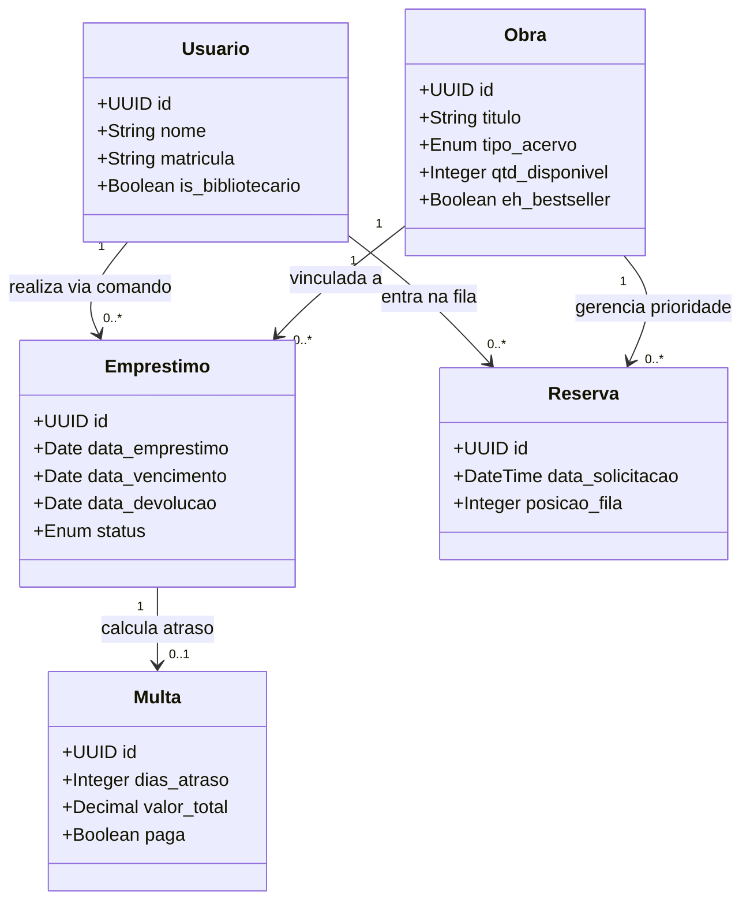

# Diagrama de Classes

```mermaid
classDiagram
    class Usuario {
        +UUID id
        +String nome
        +String matricula
        +Boolean is_bibliotecario
    }

    class Obra {
        +UUID id
        +String titulo
        +Enum tipo_acervo
        +Integer qtd_disponivel
        +Boolean eh_bestseller
    }

    class Emprestimo {
        +UUID id
        +Date data_emprestimo
        +Date data_vencimento
        +Date data_devolucao
        +Enum status
    }

    class Reserva {
        +UUID id
        +DateTime data_solicitacao
        +Integer posicao_fila
    }

    class Multa {
        +UUID id
        +Integer dias_atraso
        +Decimal valor_total
        +Boolean paga
    }

    Usuario "1" --> "0..*" Emprestimo : realiza via comando
    Usuario "1" --> "0..*" Reserva : entra na fila
    Obra "1" --> "0..*" Emprestimo : vinculada a
    Obra "1" --> "0..*" Reserva : gerencia prioridade
    Emprestimo "1" --> "0..1" Multa : calcula atraso
```